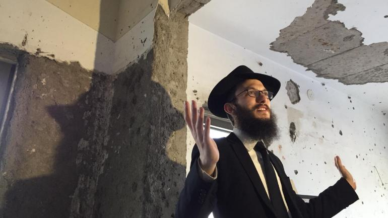

After flying in to Mumbai, we will visit the Nariman Light House (not a lighthouse) in Mumbai. The Nariman Light House was the site of a terrorist attack in 2008. The attack was by Pakistan-based terrorist group Lashkar-e-Taiba, which was not endorsed by Pakistan but still a reflection of the tensions between the two countries. The Nariman Light House was originally the Nariman House but was renamed to the Nariman Light House after the terrorist attack. We will stay in a hotel for the night.

> [Back to Map & Route](map) [Next to Day 2](day2)
