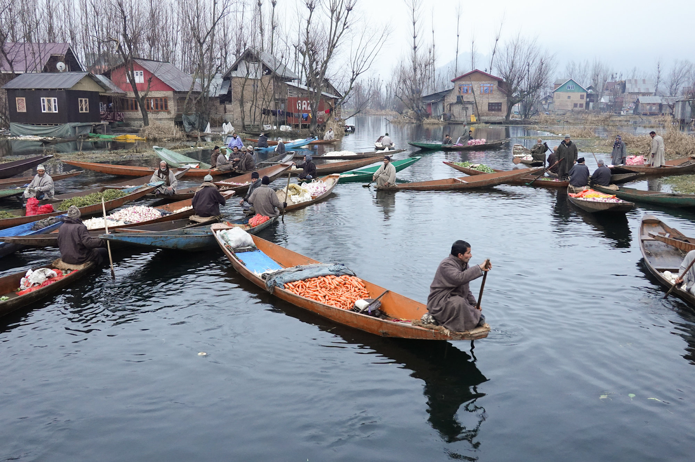

# Day 4
## Dal Lake floating market in Srinagar

We will fly to the Sheikh Ul-Alam international airport in Srinagar and then visiting the floating market at Dal Lake. The floating market at Dal Lake is a lake-based market that opens every day at dawn. Locals sell food and other commodities in boats on the water. We will be visiting the area and interviewing locals. The floating market is a lifeline to Srinagar in a very conflicted region.

> [Back to Day 3](day3) [Next to Day 5](day5)
